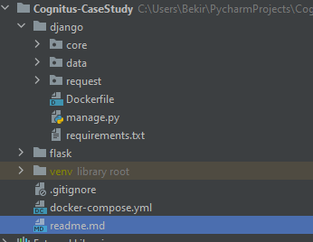
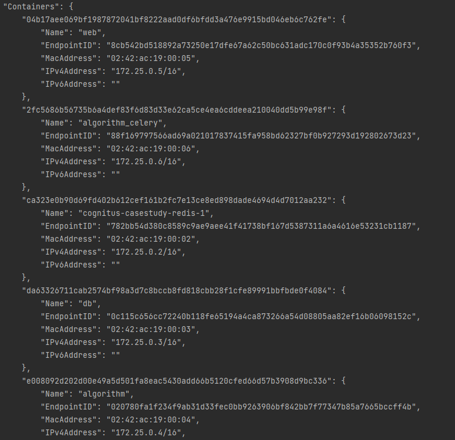

# Cognitus Case Study

### Servisler

- web(Django)
- db(PostgreSQL)
- algorithm(flask)
- algorithm_celery(celery)
- redis

### Volumes

- pgdata: Veritabanı verilerini saklar.
- models: model.pickle ve vectorize.pickle dosyalarını saklar.

docker-compose.yml dosyası içerisinde Docker için gerekli olan tüm servisler ve özellikleri belirtilmiştir.

Django uygulaması içerisinde data/urls.py ve request/urls.py dosyaları içerisinde endpoint'ler bulunabilir.

Kodları Docker üzerinde yürütmek için aşağıdaki komutların sırası ile yürütülmesi gerekmektedir.

Ardından Notes kısmı gözden geçirilmelidir.

# Commands

1- docker compose build

2- docker compose up

 Servisler Docker üzerinde çalışmaya başladıktan sonra aşağıdaki komutlar çalıştırılmalıdır. Aksi halde hata verir.

3- docker exec -it algorithm mv ../flask/models/model.pickle ../var/lib/volume

4- docker exec -it algorithm mv ../flask/models/vectorizer.pickle ../var/lib/volume

 Bu komutlar model.pickle ve vectorizer.pickle algorithm ve algorithm_celery servisleri tarafından ulaşılabilmesi adına 
models adlı volume path'ine yazdırmak için gereklidir.

5- docker exec -it web /bin/bash 
 
 Bu komutun ardından aşağıdaki komut çalıştırılmalıdır.
 
6- python manage.py migrate

 Veritabanı üzerinde tablolar oluştuktan sonra Django üzerinden veritabanına veri girişi yapılabilir.
 Veritabanı pgdata adında bir volume'a bağlıdır. web servisi ve algorithm servisi üzerinden veri kaybı
 yaşanmadan işlem yapılabilir.
 
# Notes

- Django üzerinden Flask train ve predict endpointlerine istek atarken Docker Container'ları arasında iletişim
 gerçekleştiğinden dolayı algorithm servisinin network içerisindeki IP Adresi django/request/views.py dosyası içerisinde 7.
 ve 12. satırdaki kod parçacıklarındaki 172.25.0.5 olan IP adresi network içerisindeki IP Adresine göre
 değiştirilmelidir. Network içerisindeki IP Adresi'ni bulmak için 2 yol vardır;

1- docker compose up komutu çalıştırıldıktan sonra terminalde algorithm servisinin IP Adresi bulunabilir.
 
2- docker network ls

 Aşağıdaki ekran görüntüsüne bakılırsa base directory Cognitus-CaseStudy olduğundan docket network üzerinde
 ismi cognitus-casestudy_default şeklinde olacaktır.

 
 
 "docker network inspect network_ismi" ardından bu komut çalıştırılarak network içerisindeki bilgileri görebiliriz.
 Aşağıdaki resimde örnek verilmiştir. Buradan algorithm servisi IP Adresi bulunabilir.
 

 

 

 

